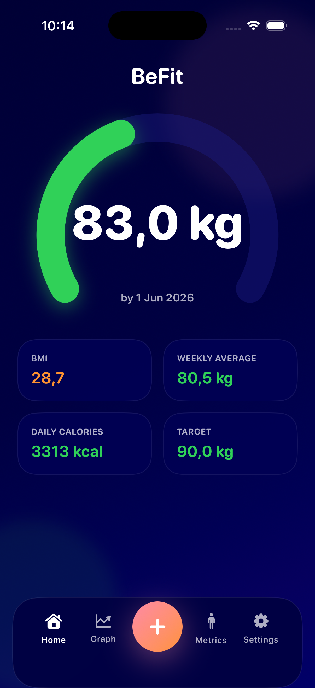
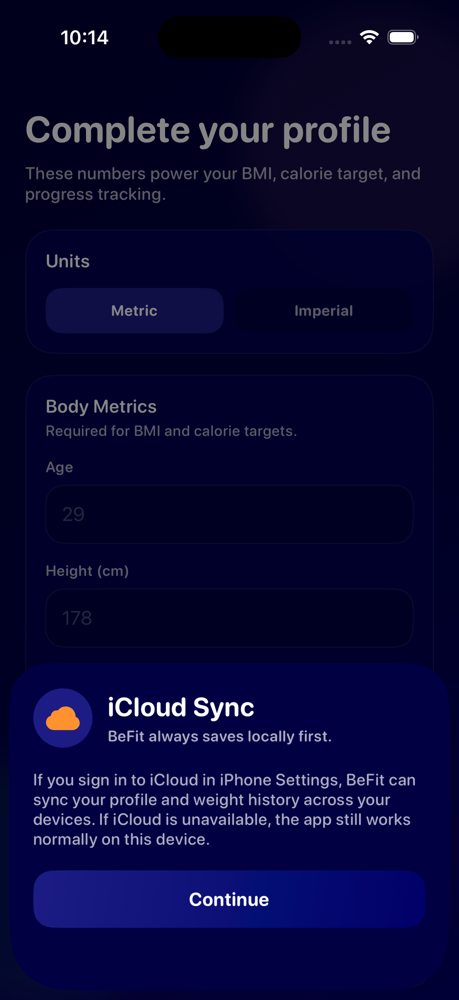
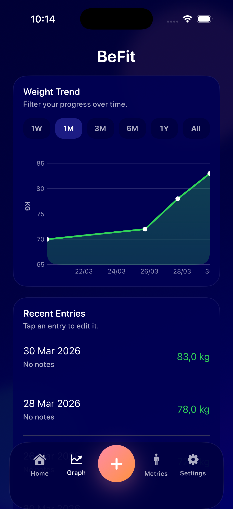
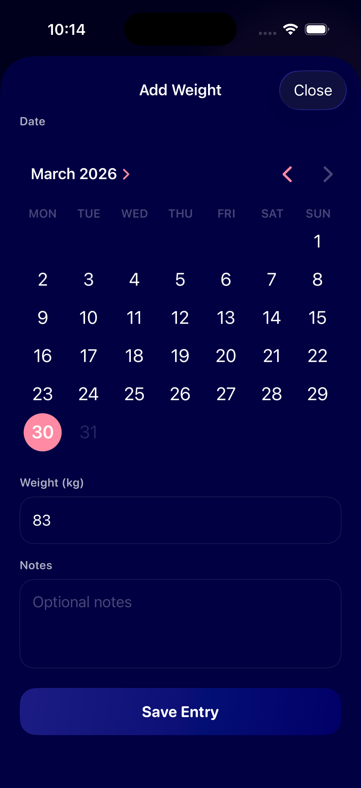
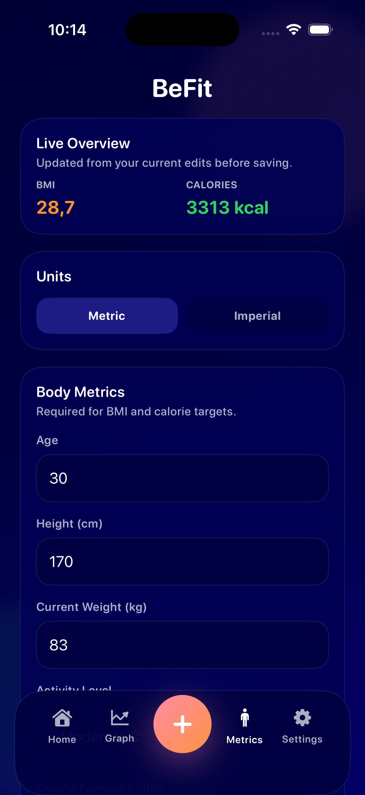
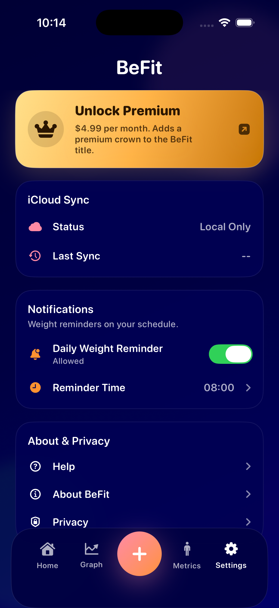

# BeFit

BeFit is a local-first iOS weight-tracking app built with SwiftUI and SwiftData.
The app stores data on-device first, keeps the UI responsive offline, and mirrors
the same profile and weight history to the user's private iCloud database when
CloudKit is available.

## Demo

BeFit is designed to make daily weight tracking simple, private, and consistent.
The app focuses on a fast local-first workflow, clear progress feedback, and
optional iCloud sync without turning setup into friction.



### Screens

<table>
  <tr>
    <td align="center"><br><sub>Profile onboarding</sub></td>
    <td align="center"><br><sub>Trend graph and entry history</sub></td>
    <td align="center"><br><sub>Fast daily entry flow</sub></td>
  </tr>
  <tr>
    <td align="center"><br><sub>Metrics and targets</sub></td>
    <td align="center"><br><sub>Sync, reminders, and premium</sub></td>
    <td align="center"><br><sub>At-a-glance dashboard</sub></td>
  </tr>
</table>

## Features

- Local-first profile and weight tracking
- One weight entry per calendar day
- Home, Graph, Metrics, and Settings tabs
- Daily reminder scheduling with local notifications
- iCloud sync status surfaced in Settings
- StoreKit 2 Premium subscription flow
- Local StoreKit test configuration for development

## Architecture

BeFit uses a small coordinator-based app layer:

- `AppStore` is the root observable state for SwiftUI.
- `LocalDataStore` is the SwiftData repository and source of truth.
- `ICloudSyncService` mirrors canonical local records to the user's private CloudKit database.
- `MetricsCoordinator` and `WeightEntryCoordinator` own mutation rules.
- `WeightTimelineNormalizer` guarantees a canonical one-entry-per-day timeline.

The core rule is: the UI reads from local SwiftData, then iCloud sync happens in
the background.

## Tech Stack

- SwiftUI
- SwiftData
- CloudKit
- UserNotifications
- StoreKit 2

## Why This Project Stands Out

- Local-first UX keeps the app useful even when iCloud is unavailable.
- Domain rules enforce a clean one-entry-per-day timeline.
- iCloud sync is explicit and observable instead of hidden behind optimistic UI.
- Premium and reminder flows are integrated without compromising the core offline experience.

## Requirements

- Xcode 26+
- iOS 26 simulator or device target
- Apple Developer account with CloudKit enabled if you want to test real iCloud sync

## Getting Started

1. Open `WeightTracker.xcodeproj` in Xcode.
2. Select the shared `WeightTracker` scheme.
3. Set your signing team in `Signing & Capabilities`.
4. If you want real iCloud sync, enable the `iCloud` capability and the container:
   `iCloud.PatrykKolosovski.WeightTracker`
5. Run the app.

## StoreKit Testing

The shared scheme includes `WeightTracker.storekit` for local subscription testing.

- Product ID: `com.befit.premium.monthly`
- Use Xcode's StoreKit testing flow to purchase Premium locally.

## Testing

The project includes a `WeightTrackerTests` unit-test target with regression
coverage for:

- form validation
- unit-system conversion stability
- one-entry-per-day rules
- timeline normalization

Run from Xcode or with:

```sh
xcodebuild -project WeightTracker.xcodeproj \
  -scheme WeightTracker \
  -sdk iphonesimulator \
  -destination 'platform=iOS Simulator,name=iPhone 16' \
  test
```

If `CoreSimulatorService` is unavailable in your shell environment, `build-for-testing`
still verifies that the app target and test target compile together.

## Project Structure

```text
WeightTracker/
  App/          App state and bootstrap
  Domain/       Shared app models and normalization logic
  Features/     SwiftUI feature screens
  Persistence/  SwiftData models and repository
  Services/     iCloud, reminders, and Premium services
  UI/           Shared design system and components
WeightTrackerTests/
  Unit tests for domain and coordinator rules
```
